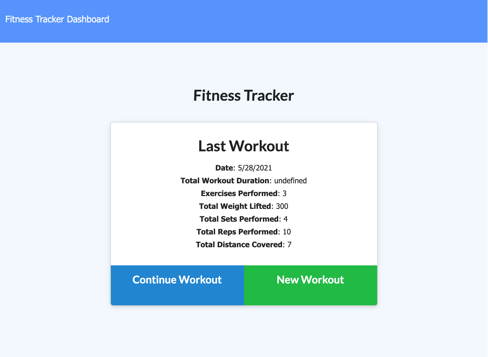
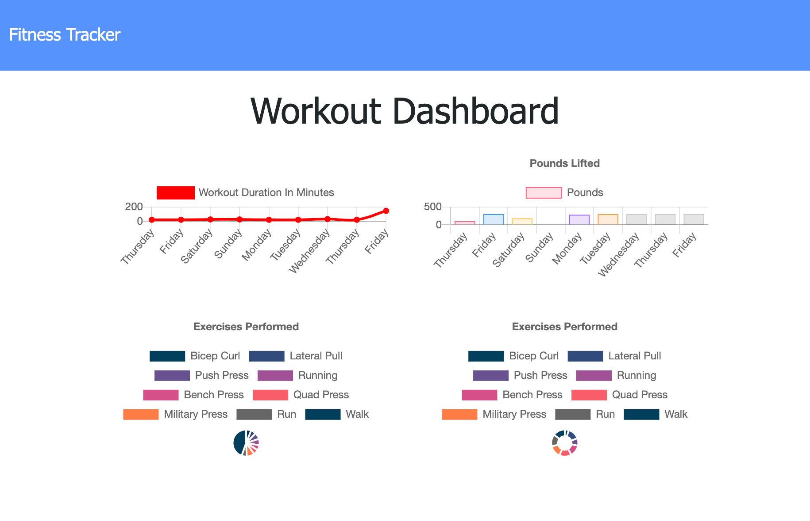
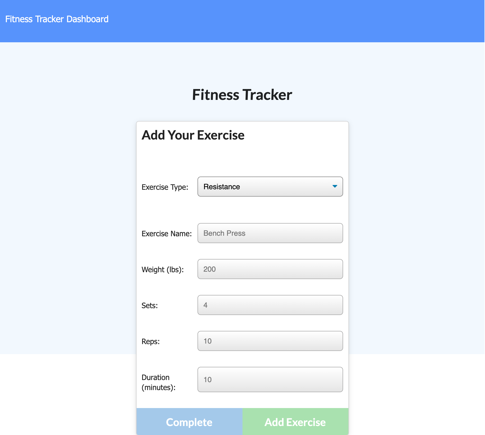

# Workout Tracker

## Project Description

This project demonstrates the use of JavaScript in conjunction with MongoDB. With **Workout Tracker**, a user can log different types fo resistance and cardio excercises and keep track on their progress.

## Project Screenshot  

## Link to Deployed Project  

https://nameless-hollows-61913.herokuapp.com/?id=60b410629cf0e7001556a455

## Background

I am a very visual person and my motivation comes from me being able to see progress and numbers. With this applicaton, not only can you add in yout workout and stay accountable that way, but you can also clearly see advances and progress in the form of a chart.

## Challenges

I kept running into the challenge of not being able to pull up all the recent workouts, however I was able to resolve that in the routes files.

## Learnings

I learned so much about MongoDB and to deploy an application on Heroku that uses this type of database structure.

## Usage

When launching the app, the user is presented with a short summary of their last workout, if it exists in the database and the option to either continue that workout or to start a new one. From there, whether they select to begin a new oen or to continue their current workout, the steps are the same - the user will select the type of excersice they have performed and enter in all the necessary information. Once entered, they can press "Complete" to complete the workout or "Add Excercise" to add this workout and then have the chance to add another activy as part of the same workout. At any time, the user can click on "Dashboard" in the top left corner and they can see a very detailed summary of their workouts with numbers and charts.

## Credits

Thank you to Columbia's Full-Stack Web Developer bootcamp for all the assistance and for teaching me all that I have learned.

## Licence

Copyright (c) 2021 Steven Stefanov

Permission is hereby granted, free of charge, to any person obtaining a copy
of this software and associated documentation files (the "Software"), to deal
in the Software without restriction, including without limitation the rights
to use, copy, modify, merge, publish, distribute, sublicense, and/or sell
copies of the Software, and to permit persons to whom the Software is
furnished to do so, subject to the following conditions:

The above copyright notice and this permission notice shall be included in all
copies or substantial portions of the Software.

THE SOFTWARE IS PROVIDED "AS IS", WITHOUT WARRANTY OF ANY KIND, EXPRESS OR
IMPLIED, INCLUDING BUT NOT LIMITED TO THE WARRANTIES OF MERCHANTABILITY,
FITNESS FOR A PARTICULAR PURPOSE AND NONINFRINGEMENT. IN NO EVENT SHALL THE
AUTHORS OR COPYRIGHT HOLDERS BE LIABLE FOR ANY CLAIM, DAMAGES OR OTHER
LIABILITY, WHETHER IN AN ACTION OF CONTRACT, TORT OR OTHERWISE, ARISING FROM,
OUT OF OR IN CONNECTION WITH THE SOFTWARE OR THE USE OR OTHER DEALINGS IN THE
SOFTWARE.
